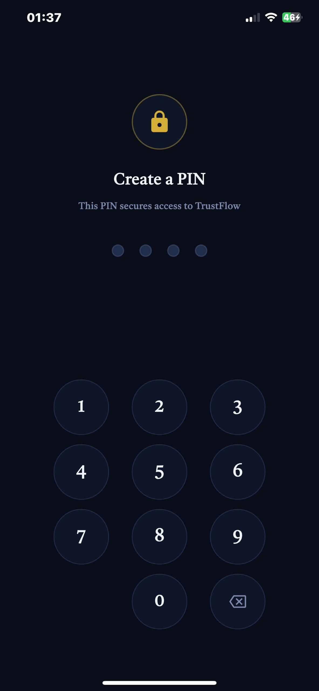
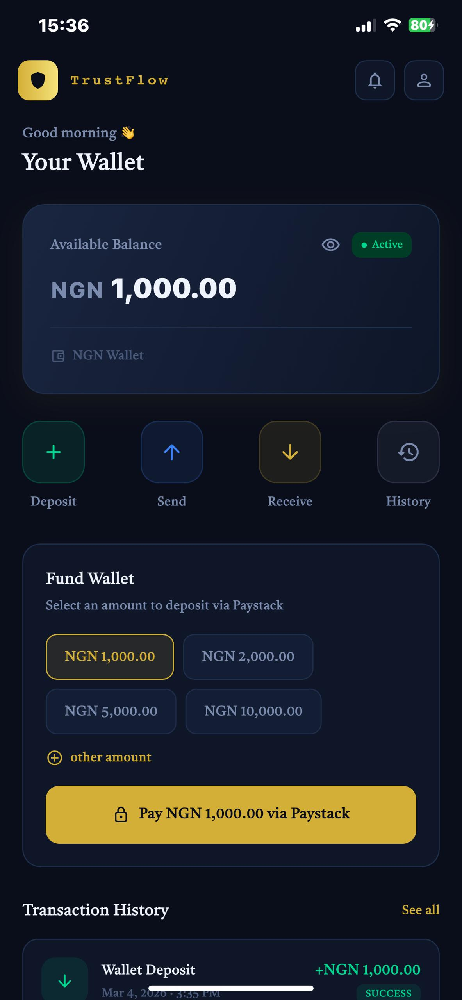
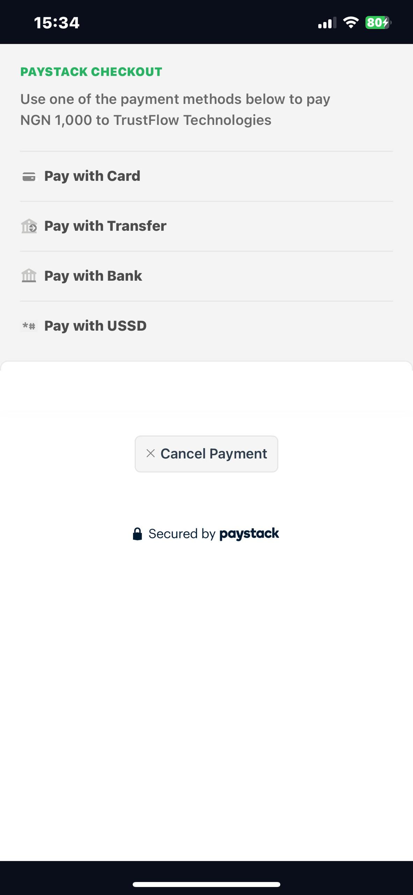
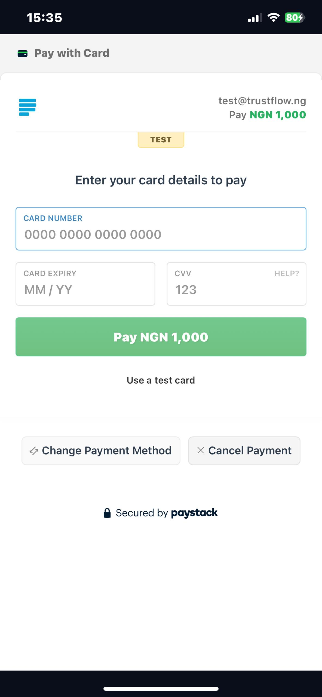

# TRUSTFLOW – Resilient Fintech Onboarding

TrustFlow is a mobile fintech onboarding and KYC application built with Flutter for Android and iOS.  
It reflects how real Nigerian fintech onboarding systems are built — focusing on reliability, regulated flows, and user trust.

In emerging markets, users often drop off during onboarding because the app restarts and loses their data, or image uploads take too long. TrustFlow solves this using State Persistence , Client-Side Compression, and Bank-Grade Security.


# The Business Problems I solved

1. Data Loss & User Frustration
Problem: In standard apps, if a user minimizes the app to copy a BVN or their phone kills the background process, the form resets. This causes users to quit.
My Solution (Hydrated State): I implemented HydratedBloc. The app automatically saves the user's progress to local storage. If the app is killed and reopened, the user returns to the exact same step with their data intact.

2. Slow Uploads & Bandwidth
Problem: Uploading a 5MB raw camera photo on a 3G network causes timeouts and high data costs.
My Solution (Compression): I wrote a service that compresses ID cards and Selfies on the device (client-side) to under 300KB before the upload starts. This makes the app faster and cheaper for the user.

3. Data Privacy & Security
Problem: Banking apps often expose sensitive data (BVN/Balance) when the user switches between apps (Multitasking view).
My Solution (Privacy Shield): I implemented a lifecycle listener that automatically blurs the app screen when it goes into the background, protecting user data from bystanders.

4. Lack of Real-Time Financial Context
Problem: Users onboarding into fintech apps often don’t see real-time financial context (like exchange rates), which reduces trust and perceived usefulness.
My Solution (Live Market Data): I integrated a real REST API using Dio to fetch live USD/NGN exchange rates. The feature is built using Clean Architecture with a RemoteDataSource, Repository, and UseCase, including proper error handling for network failures and offline states.

5. Unauthorized App Access
Problem: If a user's phone is picked up by someone else, sensitive KYC data is immediately visible with no access control.
My Solution (PIN + Biometric Authentication): I implemented a custom 4-digit PIN system with SHA-256 hashing stored in Android EncryptedSharedPreferences via flutter_secure_storage. On supported devices, users can authenticate with fingerprint or Face ID as a faster alternative. The PIN is never stored in plain text — only its hash — which is the same principle used by real banking apps.

6. No Real Biometric Verification
Problem: Most KYC demo apps fake the face verification step with a simple camera capture and no actual identity check.  
My Solution (On-Device ML Face Matching): I integrated Google ML Kit for real face detection and liveness checks (blink, smile, head turns). After liveness passes, I run MobileFaceNet TFLite on-device to extract 128-dimensional face embeddings from both the selfie and the ID document photo, then compare them using cosine similarity. The entire pipeline runs on the device — no server required. A match score above 60% approves the verification.


## 📱 DOWNLOAD APP
<a href="https://github.com/DevGR8T/TrustFlow/releases/latest/download/trustflow.apk">

</a>

## 📱 DEMO VIDEOS

- Demo video (v1.0)** — KYC onboarding flow [Watch Here](https://drive.google.com/file/d/1pN__1vaL4MnSTcIn7k7ybQC-G6mlTCUD/view?usp=sharing)
- New Features Demo (v1.2)** — PIN auth, Dashboard & Paystack payment [Watch Here](https://drive.google.com/file/d/1xCkh2czwzfyISKh7vvv6jaNjxyJxZtEv/view?usp=sharing)

## Screenshots

| Pin Entry Screen | Welcome Screen | Data Consent | Personal Details |
|:-:|:-:|:-:|:-:|
| |  |  |  | 

| Bvn Verification | Upload Document | Face Capture | Verification Status |  
|:-:|:-:|:-:|:-:|
| |  |  |  | 


| Wallet Dashboard | Paystack Checkout | Card Payment | 
|:-:|:-:|:-:|
| |  |  |


## 🧱 TECH STACK

- State Management: flutter_bloc & hydrated_bloc (for state persistence).
- Architecture: Clean Architecture (Domain, Data, Presentation layers).
- Dependency Injection: get_it (Service Locator pattern) 
- Networking: dio (for REST API integration)
- Payment Gateway: flutter_paystack
- Security: flutter_secure_storage, local_auth, crypto
- Local Storage: shared_preferences (via HydratedBloc).
- Environment Variables: flutter_dotenv
- Image Handling: image_picker & flutter_image_compress. 
- On-Device ML : tflite_flutter, google_mlkit_face_detection
- Face Matching: MobileFaceNet TFLite (128-dim cosine similarity)


## 🔄 CI/CD Pipeline (Automated Builds)

This project uses GitHub Actions to automatically validate and build the application on every push.

 Pipeline Workflow:

Every time code is pushed to the main branch:

- Environment Setup
- Installs Java 17
- Installs latest stable Flutter SDK
- Code Quality Checks
- Runs flutter analyze to enforce clean code standards
- Automated Testing
- Runs all unit tests using flutter test
- Secure Environment Injection
- Loads API keys securely using GitHub Secrets (.env file generation)
- Production Build
- Builds a Release APK for Android
- Artifact Delivery
- Uploads the generated APK as a downloadable build artifact in the Actions tab

### Why This Matters
- Prevents broken builds from reaching production  
- Ensures every change is automatically tested  
- Keeps the app in a deployable state at all times  


After every successful run, you can download the latest APK from the GitHub Actions → Artifacts section.


### INSTALLATION INSTRUCTIONS

#### Android APK Installation
1. Download the APK from the link above  
2. Enable **“Install from Unknown Sources”** in device settings  
3. Open the APK and complete installation  
4. Launch the app

   


---

## 🚀 APP FEATURES

- PIN authentication with SHA-256 hashing on first launch
- Progressive onboarding flow  
- Consent & compliance screens  
- Personal information capture  
- BVN / NIN input flow with validation  
- ID document capture (camera)  
- Selfie capture for face verification  
- Verification submission states (loading, success, failure)  
- Clear retry and error handling  
- Save & resume onboarding progress (survives app kill)
- Verification status tracking (pending, approved, failed)  
- Dashboard with live NGN wallet balance
- Paystack payment integration (test mode) — fund wallet via card
- Transaction history with NGN currency formatting
- Balance visibility toggle
- Live USD/NGN exchange rate with auto-refresh
- Screen privacy protection (blocks screenshots & multitasking preview)
- BLoC-based state management  
- Dependency Injection using GetIt for scalable architecture
- Clean Architecture structure  
- Mocked Identity Verification (BVN/NIN) & Live Market Data via REST API.
- Secure API key management via .env
- Real face detection using Google ML Kit
- Liveness checks — blink, smile, head turn left, head turn right
- MobileFaceNet TFLite face matching — selfie vs ID document
- Cosine similarity score displayed after verification
- Entire biometric pipeline runs on-device, no server needed


## 📂 PROJECT STRUCTURE

```
lib
├── core
│   ├── constants
│   │   ├── app_constants.dart
│   │   ├── colors.dart
│   │   ├── strings.dart
│   │   └── theme.dart
│   ├── di
│   │   └── injection_container.dart
│   ├── error
│   │   ├── exceptions.dart
│   │   └── failures.dart
│   ├── ml
│   │   └── face_match_service.dart
│   ├── security
│   │   ├── auth_guard.dart
│   │   ├── biometric_service.dart
│   │   └── pin_service.dart
│   └── utils
│       ├── bvn_validator.dart
│       ├── helpers.dart
│       ├── image_compressor.dart
│       ├── phone_input_formatter.dart
│       ├── phone_validator.dart
│       ├── secure_screen_mixin.dart
│       └── validators.dart
├── features
│   ├── auth
│   │   └── presentation
│   │       └── screens
│   │           ├── pin_entry_screen.dart
│   │           └── pin_setup_screen.dart
│   ├── dashboard
│   │   ├── data
│   │   │   ├── models
│   │   │   │   └── transaction_model.dart
│   │   │   └── repositories
│   │   │       └── wallet_repository_impl.dart
│   │   ├── domain
│   │   │   ├── entities
│   │   │   │   ├── transaction.dart
│   │   │   │   └── wallet.dart
│   │   │   ├── repositories
│   │   │   │   └── wallet_repository.dart
│   │   │   └── usecases
│   │   │       ├── deposit_funds.dart
│   │   │       ├── get_transactions.dart
│   │   │       └── get_wallet.dart
│   │   └── presentation
│   │       ├── bloc
│   │       │   ├── wallet_bloc.dart
│   │       │   ├── wallet_event.dart
│   │       │   └── wallet_state.dart
│   │       └── screens
│   │           └── dashboard_screen.dart
│   ├── market_rates
│   │   ├── data
│   │   │   ├── datasources
│   │   │   │   └── exchange_rate_remote_datasource.dart
│   │   │   ├── models
│   │   │   │   └── exchange_rate_model.dart
│   │   │   └── repositories
│   │   │       └── exchange_rate_repository_impl.dart
│   │   ├── domain
│   │   │   ├── entities
│   │   │   │   └── exchange_rate.dart
│   │   │   ├── repositories
│   │   │   │   └── exchange_rate_repository.dart
│   │   │   └── usecases
│   │   │       └── get_usd_ngn_rate.dart
│   │   └── presentation
│   │       ├── bloc
│   │       │   ├── exchange_rate_bloc.dart
│   │       │   ├── exchange_rate_event.dart
│   │       │   └── exchange_rate_state.dart
│   │       └── widgets
│   │           └── exchange_rate_banner.dart
│   └── onboarding
│       ├── data
│       │   ├── models
│       │   │   ├── user_data_model.dart
│       │   │   └── verification_response_model.dart
│       │   └── repositories
│       │       ├── document_capture_repository_impl.dart
│       │       ├── face_match_repository_impl.dart
│       │       ├── liveness_detector_repository_impl.dart
│       │       ├── mock_verification_repository.dart
│       │       └── verification_repository_impl.dart
│       ├── domain
│       │   ├── entities
│       │   │   ├── document_type.dart
│       │   │   ├── liveness_step.dart
│       │   │   ├── onboarding_progress.dart
│       │   │   ├── user_data.dart
│       │   │   └── verification_result.dart
│       │   ├── repositories
│       │   │   ├── document_capture_repository.dart
│       │   │   ├── face_match_repository.dart
│       │   │   ├── liveness_detector_repository_impl.dart
│       │   │   └── verification_repository.dart
│       │   └── usecases
│       │       ├── get_saved_progress.dart
│       │       ├── match_faces.dart
│       │       ├── save_progress.dart
│       │       ├── upload_document.dart
│       │       ├── upload_face_capture.dart
│       │       └── verify_bvn.dart
│       └── presentation
│           ├── bloc
│           │   ├── face_match_bloc.dart
│           │   ├── face_match_event.dart
│           │   ├── face_match_state.dart
│           │   ├── onboarding_bloc.dart
│           │   ├── onboarding_event.dart
│           │   └── onboarding_state.dart
│           ├── screens
│           │   ├── bvn_input_screen.dart
│           │   ├── consent_screen.dart
│           │   ├── document_capture_screen.dart
│           │   ├── face_capture_screen.dart
│           │   ├── personal_info_screen.dart
│           │   ├── verification_status_screen.dart
│           │   └── welcome_screen.dart
│           └── widgets
│               ├── custom_button.dart
│               ├── error_dialog.dart
│               ├── loading_overlay.dart
│               ├── page_transitions.dart
│               ├── progress_indicator_widget.dart
│               └── subtle_grid_background.dart
└── main.dart

```


## 🔧 DEVELOPMENT SETUP

### Prerequisites
- Flutter SDK (latest stable)
- Dart SDK
- Android Studio or VS Code

### Getting Started
1. Clone the repository  

2. Install dependencies:
   flutter pub get

3. Create a .env file in the project root:
 - EXCHANGE_RATE_API_KEY=your_api_key_here
 - PAYSTACK_PUBLIC_KEY=pk_test_your_paystack_key

4. Run the app:
  flutter run


### Paystack Test Card
- Card Number : 4084 0840 8408 4081
- Expiry      : any future date(e.g. 12/30)
- CVV         : 408
- PIN         : 0000
- OTP         : 123456


### BVN Test Credentials
  BVN : 20000000008


