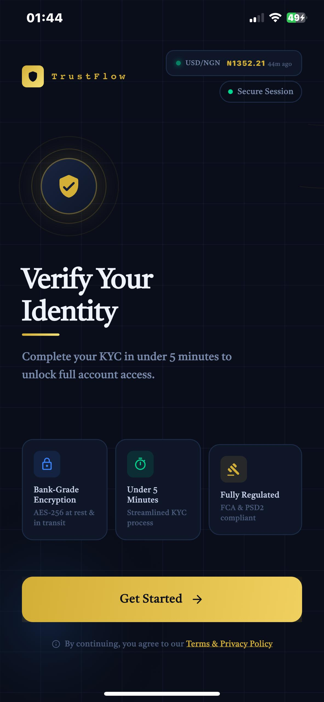
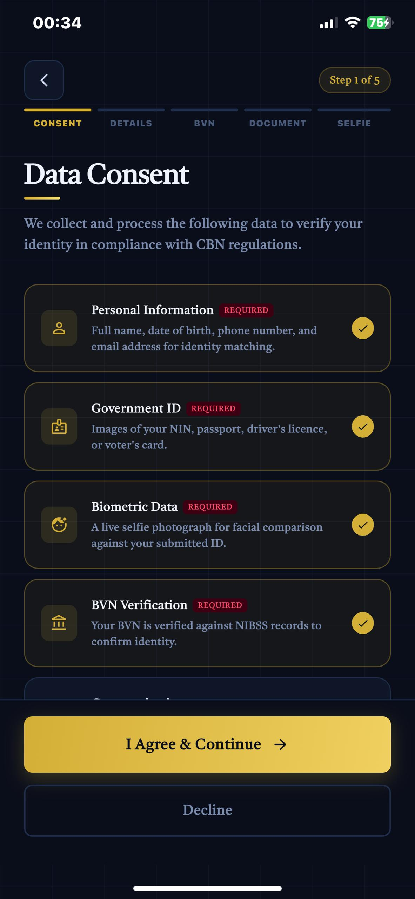
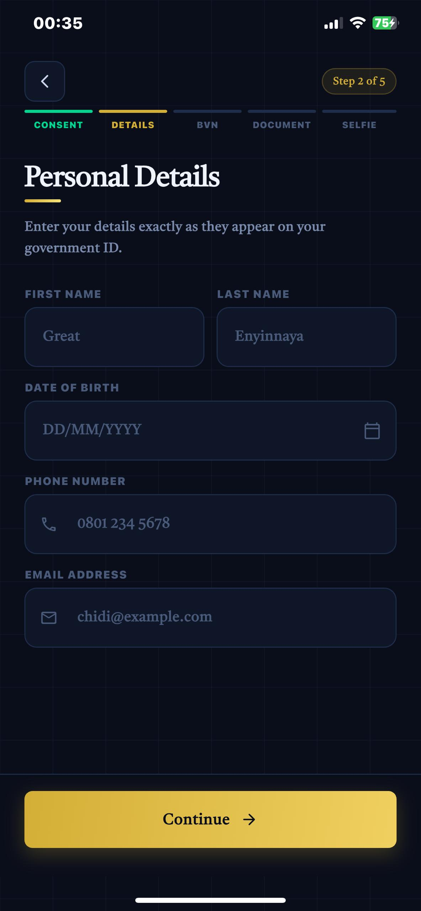
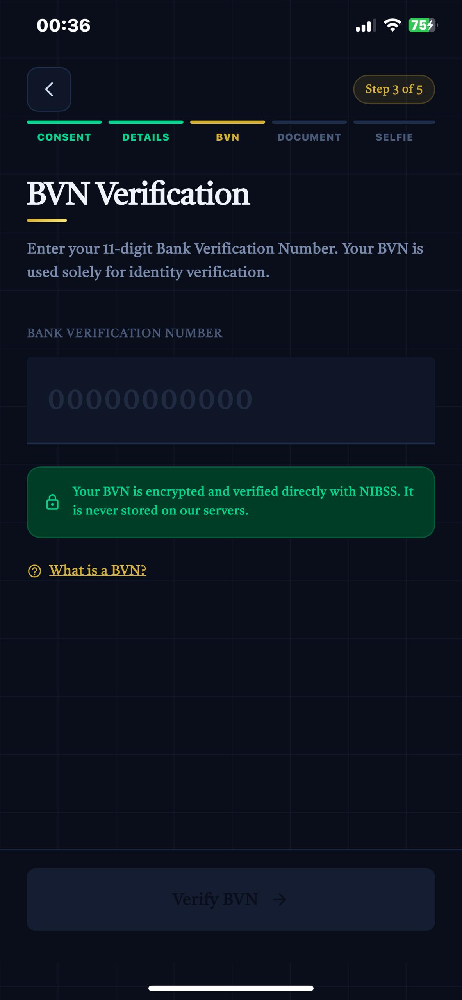
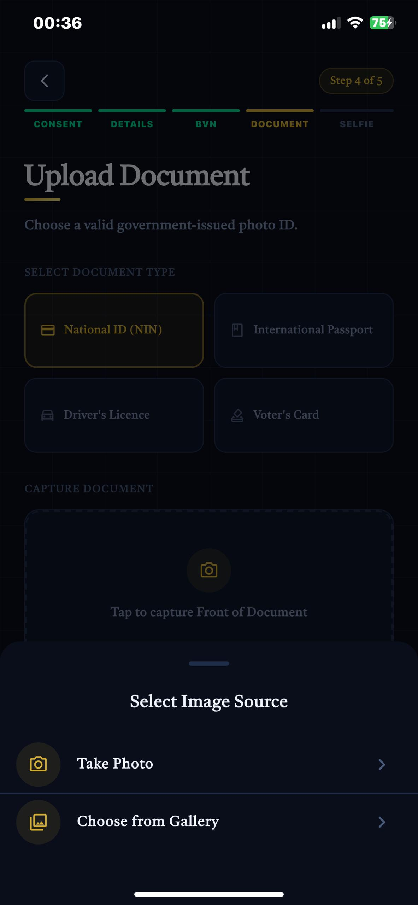
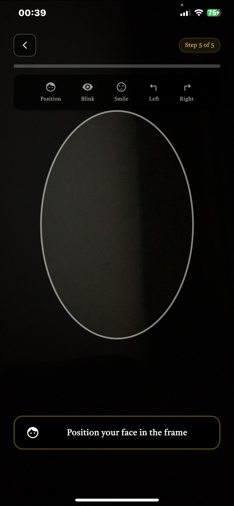
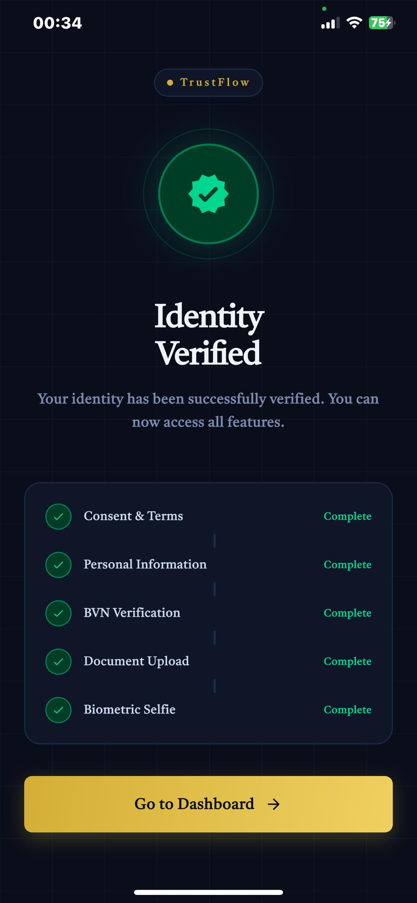

# TRUSTFLOW – FINTECH ONBOARDING & KYC APP

TrustFlow is a mobile fintech onboarding and KYC application built with Flutter for Android and iOS.  
It reflects how real Nigerian fintech onboarding systems are built — focusing on reliability, regulated flows, and user trust.


## 📱 DOWNLOAD APP
<a href="https://github.com/DevGR8T/TrustFlow/releases/latest/download/trustflow.apk">

</a>

## 📱 DEMO VIDEO
You can see a Demo video [Here](https://drive.google.com/file/d/1pN__1vaL4MnSTcIn7k7ybQC-G6mlTCUD/view?usp=sharing)

## Screenshots

| Welcome Screen | Data Consent | Personal Details | Bvn Verification |
|:-:|:-:|:-:|:-:|
|  |  |  |  |

| Upload Document | Face Capture | Verification Status |  |   
|:-:|:-:|:-:|:-:|
|  |  |  | 


### SYSTEM REQUIREMENTS
- **Android**: Android 5.0 (API level 21) or higher
- **iOS**: iOS 12.0 or later


## 🧱 TECH STACK

- Flutter  
- Dart  
- BLoC (state management)  
- Clean Architecture  
- REST API (mocked)  
- Local storage  
- Camera & device permissions  


### INSTALLATION INSTRUCTIONS

#### Android APK Installation
1. Download the APK from the link above  
2. Enable **“Install from Unknown Sources”** in device settings  
3. Open the APK and complete installation  
4. Launch the app

   


---

## 🚀 APP FEATURES

- Progressive onboarding flow  
- Consent & compliance screens  
- Personal information capture  
- BVN / NIN input flow with validation  
- ID document capture (camera)  
- Selfie capture for face verification  
- Verification submission states (loading, success, failure)  
- Clear retry and error handling  
- Save & resume onboarding progress  
- Verification status tracking (pending, approved, failed)  
- BLoC-based state management  
- Clean Architecture structure  
- Mocked REST API integration  


## 📂 PROJECT STRUCTURE

```
lib
├── core
│   ├── constants
│   │   ├── app_constants.dart
│   │   ├── colors.dart
│   │   ├── strings.dart
│   │   └── theme.dart
│   ├── error
│   │   ├── exceptions.dart
│   │   └── failures.dart
│   └── utils
│       ├── bvn_validator.dart
│       ├── helpers.dart
│       ├── phone_input_formatter.dart
│       ├── phone_validator.dart
│       └── validators.dart
├── features
│   └── onboarding
│       ├── data
│       │   ├── models
│       │   │   ├── user_data_model.dart
│       │   │   └── verification_response_model.dart
│       │   └── repositories
│       │       ├── document_capture_repository_impl.dart
│       │       ├── liveness_detector_repository_impl.dart
│       │       ├── mock_verification_repository.dart
│       │       └── verification_repository_impl.dart
│       ├── domain
│       │   ├── entities
│       │   │   ├── document_type.dart
│       │   │   ├── liveness_step.dart
│       │   │   ├── onboarding_progress.dart
│       │   │   ├── user_data.dart
│       │   │   └── verification_result.dart
│       │   ├── repositories
│       │   │   ├── document_capture_repository.dart
│       │   │   ├── liveness_detector_repository_impl.dart
│       │   │   └── verification_repository.dart
│       │   └── usecases
│       │       ├── get_saved_progress.dart
│       │       ├── save_progress.dart
│       │       ├── upload_document.dart
│       │       ├── upload_face_capture.dart
│       │       └── verify_bvn.dart
│       └── presentation
│           ├── bloc
│           │   ├── onboarding_bloc.dart
│           │   ├── onboarding_event.dart
│           │   └── onboarding_state.dart
│           ├── screens
│           │   ├── bvn_input_screen.dart
│           │   ├── consent_screen.dart
│           │   ├── document_capture_screen.dart
│           │   ├── face_capture_screen.dart
│           │   ├── personal_info_screen.dart
│           │   ├── verification_status_screen.dart
│           │   └── welcome_screen.dart
│           └── widgets
│               ├── custom_button.dart
│               ├── error_dialog.dart
│               ├── loading_overlay.dart
│               ├── page_transitions.dart
│               ├── progress_indicator_widget.dart
│               └── subtle_grid_background.dart
└── main.dart
```

## 🔧 DEVELOPMENT SETUP

### Prerequisites
- Flutter SDK (latest stable)
- Dart SDK
- Android Studio or VS Code

### Getting Started
1. Clone the repository  
2. Install dependencies:
3. flutter pub get
4. flutter run
  


